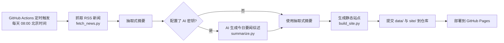

# 每日新闻速览（GitHub Actions 自动部署）

每天定时从 RSS 源抓取**科技互联网 + 综合热点**新闻，自动生成摘要与静态网页，并部署到
GitHub Pages。全程零第三方依赖（纯 Python 标准库），无需安装任何软件。

## 工作流程



## 目录结构

```
news-daily/
├── config.py                 # 新闻源、抓取数量、AI 配置（改这里即可）
├── fetch_news.py             # 抓取 RSS 新闻 → data/news_日期.json
├── summarize.py              # AI 总结（可选）→ data/summary_日期.md
├── build_site.py             # 生成页面 → site/
├── .github/workflows/daily.yml  # 每日定时 + 自动部署
├── data/                     # 每天抓取的原始数据（自动生成，随仓库提交）
└── site/                     # 生成的网页（自动生成，即 Pages 站点内容）
```

## 本地试运行

```bash
python fetch_news.py      # 抓取新闻
python summarize.py       # AI 总结（未配密钥则跳过）
python build_site.py      # 生成页面
```

然后用浏览器打开 `site/index.html` 预览当天效果。

## 部署到 GitHub

1. **新建仓库**：在 GitHub 上创建一个新仓库（如 `news-daily`），不要勾选自动生成
   README（保持空仓库），然后执行：

   ```bash
   git init
   git add .
   git commit -m "init: 每日新闻速览"
   git branch -M main
   git remote add origin https://github.com/<你的用户名>/news-daily.git
   git push -u origin main
   ```

2. **开启 Pages**：仓库 `Settings → Pages → Source` 选择 **GitHub Actions**，保存。
3. **手动测试一次**：进入 `Actions` 页面，选中 `Daily News Digest`，点
   `Run workflow` 手动触发一次，等跑完。
4. **查看结果**：跑完后会显示部署链接 `https://<用户名>.github.io/news-daily/`，
   打开即可看到当天的新闻速览。
5. **之后每天自动运行**：工作流已配置每天 08:00（北京时间）自动抓取、生成、部署，
   无需任何手动操作。

## 开启 AI 总结（可选）

在仓库 `Settings → Secrets and variables → Actions` 中新增以下 Secret：

| Secret 名称  | 说明                                             | 示例                    |
| ------------ | ------------------------------------------------ | ----------------------- |
| `AI_API_KEY` | 大模型密钥（OpenAI 兼容接口，DeepSeek/OpenAI 均可） | `sk-xxxx`               |
| `AI_API_BASE`| 接口地址（可选，默认 DeepSeek）                    | `https://api.deepseek.com/v1` |
| `AI_MODEL`   | 模型名（可选，默认 deepseek-chat）                 | `deepseek-chat`          |

配好后手动触发一次 workflow 即可看到页面顶部的「今日要闻综述（AI）」卡片。
不配置密钥则完全不影响运行，页面自动使用抽取式摘要。

## 常见修改

- **改新闻源**：编辑 `config.py` 里的 `NEWS_FEEDS`，格式为 `"名称": ("RSS地址", "分类")`。
- **改抓取数量**：`config.py` 中 `MAX_ITEMS_PER_FEED` / `MAX_ITEMS_TOTAL`。
- **改运行时间**：编辑 `.github/workflows/daily.yml` 里的 cron 表达式。北京时间 = UTC + 8，
  例如每天 07:30 跑：`30 23 * * *`。
- **改分类**：把源的第二项改成任意名称即可，页面会自动生成对应分区。

## 常见问题

- **抓不到新闻**：某些源的 RSS 地址可能失效，在 Actions 日志里看哪个源 `[失败]`，
  去 `config.py` 增删源即可；每个源失败不会影响其他源。
- **部署失败**：确认已在 `Settings → Pages` 里把 Source 设为 **GitHub Actions**。
- **AI 卡片没出现**：确认 Secret 名称拼写正确，且模型/接口地址与密钥匹配。
